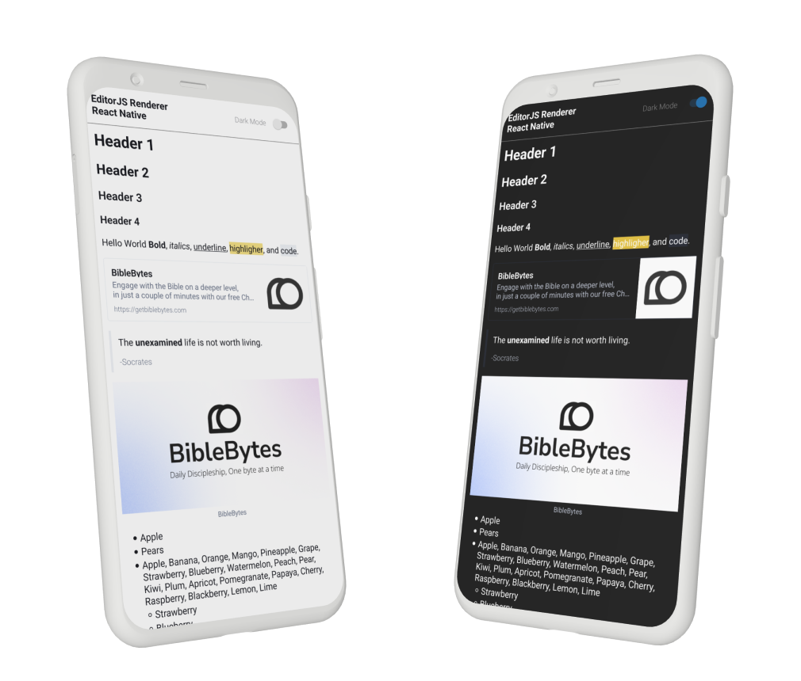

# FIXME - ADD HEADER


<style>
pre, code {
    tab-size: 4;
}
</style>

---

## Overview
The EditorJS Renderer for React Native is a library that renders React Native components from the JSON generated by [Editor.js](https://editorjs.io/). It supports basic Editor.js components right out of the box and also provides the flexibility to create custom components. Furthermore, the renderer offers built-in support for both light and dark modes.




<br/>

## Installation
To install the package via npm, run:
```cmd
npm i @biblebytes/editorjs-renderer-react-native
```

<br/>


## Supported EditorJS Components:
- [`Code`](https://github.com/editor-js/code)
- [`Delimiter`](https://github.com/editor-js/delimiter)
- [`Header`](https://github.com/editor-js/header)
- [`Image`](https://github.com/editor-js/image)
- [`Simple Image`](https://github.com/editor-js/simple-image)
- [`Link`](https://github.com/editor-js/link)
- [`List`](https://github.com/editor-js/list)
- [`Marker`](https://github.com/editor-js/marker)
- [`Paragraph`](https://github.com/editor-js/paragraph)
- [`Personality`](https://github.com/editor-js/personality)
- [`Quote`](https://github.com/editor-js/quote)
- [`Underline`](https://github.com/editor-js/underline)
- [`Custom block type`](#adding-custom-components)


<br/>


## Usage
Start by defining the EditorJS data with the type `EditorJSData` (only the blocks are required). Next, define the config using the `RendererConfig` type; for more details, refer to [config](#config). After that, you can create the `Renderer` component—it's recommended to place it within a ScrollView. Additionally, you can pass an `appearance` to the renderer, either `light` or `dark`, which will set the theme.

```tsx
import { ScrollView } from 'react-native';
import {
	EditorJSData,
	Renderer,
	RendererConfig,
	RendererAppearance
} from '@biblebytes/editorjs-renderer-react-native';

const data:EditorJSData = {
	blocks: [{
		id: "header-1",
		type: "header",
		data: {
			text: "Header 1",
			level: 1,
		},
	}]
};

const config:RendererConfig = {
    enableFallback: false
};

export default function App() {
	return (
		<>
			<ScrollView style={{ backgroundColor: "white", padding: 10 }}>
			<Renderer
				data={data}
				config={config}
				appearance={RendererAppearance.light}
			/>
			</ScrollView>
		</>
	)
}
```

<br/>


## Config
The `RendererConfig` type allows you to customize the rendering behavior of the EditorJS Renderer for React Native. Here's an overview of the config options:

```ts
export type RendererConfig = {
    components: {
        [key: string]: Component | undefined;
        header?: Component;
        bold?: Component;
        italic?: Component;
        mark?: Component;
        underline?: Component;
        paragraph?: Component;
        delimiter?: Component;
        linkTool?: Component;
        personality?: Component;
        quote?: Component;
        image?: Component;
        list?: Component;
        code?: Component;
    };
    enableFallback: boolean;
};
```

### Components
The components field allows you to define custom components for specific Editor.js blocks. For each block type (such as header, bold, image, etc.), you can either provide a custom Component or leave it undefined. For example, you could create a custom React Native component to render a specific block type in your app.

### Enable Fallback
When set to `true`, enableFallback enables a fallback mechanism for unsupported blocks. If the renderer encounters a block it doesn’t recognize (e.g., a custom block added to your Editor.js setup), it will show a fallback UI. This is especially useful during development to identify unsupported blocks. However, it’s recommended to disable this in production.


<br/>


## Adding Custom Components
To add a custom component, simply define the component and then reference it in the components field of the RendererConfig. For example, if you want to create a custom component for rendering a `thing` block, you can do so as follows:

```tsx
import React from "react";
import { Text, View } from "react-native";
import { RendererComponentProps } from "@biblebytes/editorjs-renderer-react-native";

// Custom Thing Component
const ThingComponent = (props: RendererComponentProps & { data: { text:string } }) => {
	return (
		<Text style={{ fontStyle: 'italic', color: 'gray' }}>
			{props.data.text}
		</Text>
	);
};

// Define the RendererConfig
const config: RendererConfig = {
	components: {
		thing: ThingComponent,
	},
	enableFallback: false,
};

```


<br/>


## Modifying Existing Components
You can also modify the default components' styles or functionality. This is useful if you want to maintain the default behavior but just tweak the appearance or add some custom logic.

For instance, if you want to change the style of the default `header` component, you can do so by defining it in the components field like this:

```tsx
const config:RendererConfig = {
	enableFallback: false,
	components: {
		header: (props: HeaderProps) => (
			<Header
				{...props}
				style={{ color: "blue" }}
			/>
		)
	}
}
```

Take a look at the properties for each component in the codebase, because depending on the component you can customize alot about how it looks or behaves.


<br/>


## Open Source
This project is a fork of [editorjs-viewer-native](https://github.com/Hidekih/editorjs-viewer-native) by Hidekih.
Feel free to clone/fork this project!
